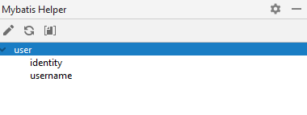
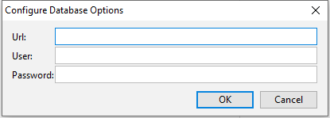
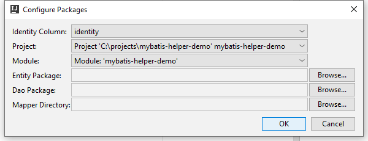

## IntelliJ IDEA Plugin

### 简介

这个插件可以帮助你生成 mybatis 文件

> 在使用这个插件之前，请先将 *mybatis-helper* 库添加到你的项目中

### 安装插件

搜素 “*mybatis helper*“ 并且安装，在开发工具重启之后，你就可以看到该插件了

#### 命令按钮

命令按钮总共有三个，从左至右分别是：

1. 配置数据库信息
2. 加载所有的数据库表
3. 生成文件的对话框

### 配置数据库信息

### 生成文件的对话框

1. Identity Column：告诉插件该数据库表的标识符列是哪个
2. Project：选择项目
3. Module：选择模块
4. Entity Package：哪个包将存放实体类
5. Dao Package：哪个包将存放数据访问接口类
6. Mapper Directory：哪个文件夹将存放映射配置文件